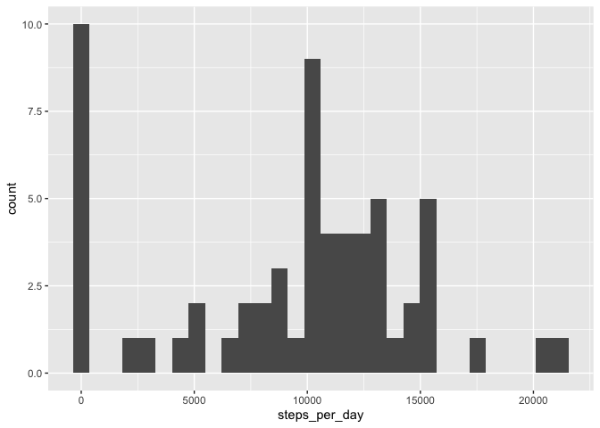
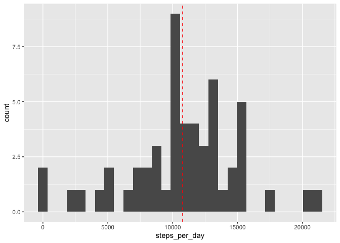
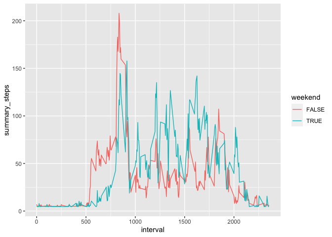

## Loading and preprocessing the data

Here we read the data in.  Note that I unzipped the file on my computer.  Also, I convert the date into a format that is recognized natively in R.


```r
library(magrittr)
library(tidyverse)
```

```
## ── Attaching packages ─────────────────────────────────────── tidyverse 1.3.1 ──
```

```
## ✓ ggplot2 3.3.5     ✓ purrr   0.3.4
## ✓ tibble  3.1.6     ✓ dplyr   1.0.8
## ✓ tidyr   1.2.0     ✓ stringr 1.4.0
## ✓ readr   2.1.2     ✓ forcats 0.5.1
```

```
## ── Conflicts ────────────────────────────────────────── tidyverse_conflicts() ──
## x tidyr::extract()   masks magrittr::extract()
## x dplyr::filter()    masks stats::filter()
## x dplyr::lag()       masks stats::lag()
## x purrr::set_names() masks magrittr::set_names()
```

```r
library(dplyr)
data <- read.csv("activity.csv")
data$date <- as.Date(data$date)
summary(data)
```

```
##      steps             date               interval     
##  Min.   :  0.00   Min.   :2012-10-01   Min.   :   0.0  
##  1st Qu.:  0.00   1st Qu.:2012-10-16   1st Qu.: 588.8  
##  Median :  0.00   Median :2012-10-31   Median :1177.5  
##  Mean   : 37.38   Mean   :2012-10-31   Mean   :1177.5  
##  3rd Qu.: 12.00   3rd Qu.:2012-11-15   3rd Qu.:1766.2  
##  Max.   :806.00   Max.   :2012-11-30   Max.   :2355.0  
##  NA's   :2304
```

Here we see that there are quite a few missing values (2304 NAs in the steps).  Also, the number of "zero step" intervals is quite unusual.  Obviously people do not walk when they sleep; however, I suspect that many "zero step" intervals are similar to NAs.


## What is mean total number of steps taken per day?


```r
data %>%
        group_by(date) %>% 
        summarize(steps_per_day = sum(steps,na.rm=TRUE)) %>% 
        ggplot(aes(x=steps_per_day))+
        geom_histogram()
```

```
## `stat_bin()` using `bins = 30`. Pick better value with `binwidth`.
```

<!-- -->


The histogram shows that there are a ton of zero step days, which is deply unusal.  This makes me think that zero step days are effectively the same as NAs.  The average number of steps taken per day is only 9354.


```r
temp <- data %>%
        group_by(date) %>% 
        summarize(mean_steps = sum(steps,na.rm=TRUE))

mean(temp$mean_steps, na.rm= TRUE)
```

```
## [1] 9354.23
```

Instead of treating the zeroes as normal cases, we can also simply drop the observations from any day that records zero steps overall (the person left their pedometer at home?).  If we do this, we see the average number of steps per day is closer to 10K.


```r
data %>%
        group_by(date) %>% 
        summarize(steps_per_day = sum(steps,na.rm=TRUE)) %>% 
        filter(steps_per_day != 0) %>% 
                summarize(total_mean = mean(steps_per_day,na.rm=TRUE),
                          total_media = median(steps_per_day, na.rm=TRUE))
```

```
## # A tibble: 1 × 2
##   total_mean total_media
##        <dbl>       <int>
## 1     10766.       10765
```


```r
data %>%
        group_by(date) %>% 
        summarize(steps_per_day = sum(steps,na.rm=TRUE)) %>% 
        filter(steps_per_day != 0) %>% 
        ggplot(aes(x=steps_per_day))+
        geom_histogram()+
        geom_vline(xintercept=10766.19, linetype = "dashed", color = "red")
```

```
## `stat_bin()` using `bins = 30`. Pick better value with `binwidth`.
```

<!-- -->

## What is the average daily activity pattern?

Below shows the average step count by 5-minute block.  Note that the overall "shape" of the activity will not be changed by removing the zero step days (it would just scale up the overall picture).


```r
data %>%
        group_by(interval) %>% 
        summarize(summary_steps = mean(steps,na.rm=TRUE),
                  max_steps = max(steps,na.rm = TRUE)) %>% 
        ggplot(aes(x=interval, y=summary_steps))+
        geom_line()+
        geom_vline(xintercept = 835, linetype = "dashed", color = "red")
```

<!-- -->

Steps begin at just after 5AM and continue through the day until about 8-9PM when activity begins to taper off.

There are peaks around 8-9AM (commute to work?).  There are smaller peaks around noon and 4PM (lunch break and end of work day respectively?).

The maximum 5 minute interval peak typically occurs at 8:35AM.

```r
temp<-data %>%
        group_by(interval) %>% 
        summarize(summary_steps = mean(steps,na.rm=TRUE))

temp[temp$summary_steps==max(temp$summary_steps),]
```

```
## # A tibble: 1 × 2
##   interval summary_steps
##      <int>         <dbl>
## 1      835          206.
```


## Imputing missing values

Let's do some sort of silly imputation.  For any value that is marked as NA, we will impute the average value.


```r
data[is.na(data$steps),]$steps <- mean(data$steps,na.rm=TRUE)
```


## Are there differences in activity patterns between weekdays and weekends?

First we create a variable to distinguish between weekdays and weekends.  


```r
data$weekend<- weekdays(data$date)=="Sunday" | weekdays(data$date)=="Saturday"
```

Now we plot the two patterns:


```r
data %>%
        group_by(weekend, interval) %>% 
        summarize(summary_steps = mean(steps,na.rm=TRUE)) %>% 
        ggplot(aes(x=interval, y=summary_steps, color=weekend))+
        geom_line()
```

```
## `summarise()` has grouped output by 'weekend'. You can override using the
## `.groups` argument.
```

<!-- -->


Interestingly,the two patterns are quite different: 
* The week days begin much earlier and have a peak around 8:30A.  They then have a lower average step count throughout the day
* Weekends see a later start but a higher step count throughout the day (perhaps hiking for fun?)

